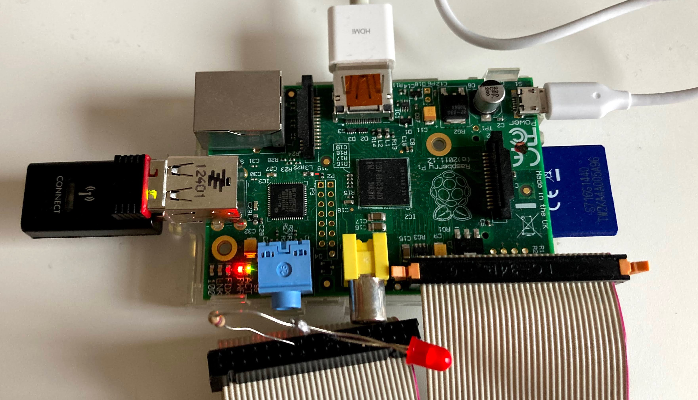
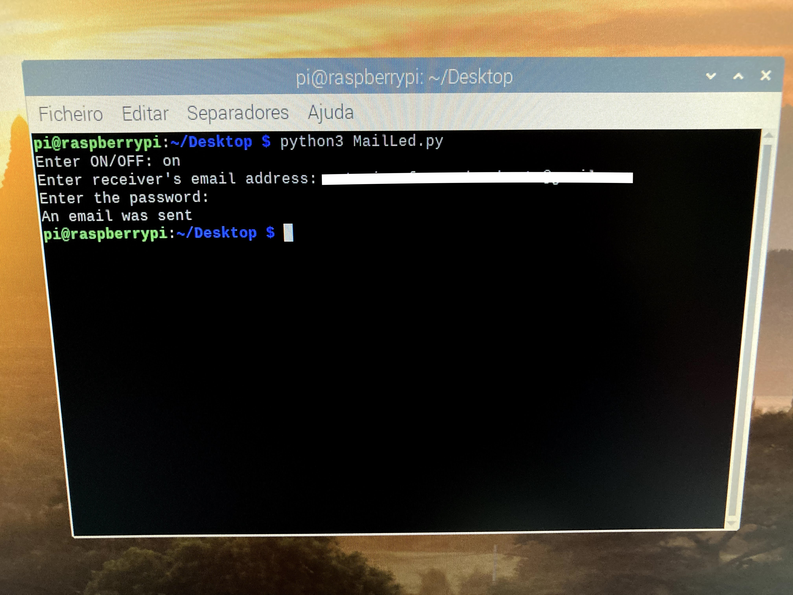
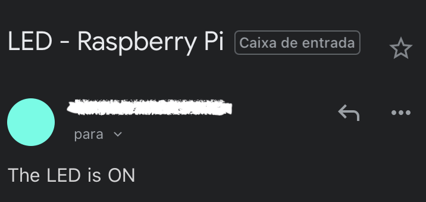

# Mail-Led

#### A small python Iot project that sends an email saying the Raspberry Pi LED status

For this project you need:
- Raspberry Pi 2 (Raspberry Pi OS with desktop)
- LED
- 270Ω Resistor

To connect the LED, use Raspberry Pi's row of GPIO (General-Purpose Input/Output) like shown in the following picture:
- Ground (14)
- GPIO 14 (8)

To run this program, first configure `mail_config.json`:

- "from" - Email address that will send the email
- "smtp" - SMTP address
- "port" - SMTP port

After that, run the program in the **terminal** with the command below:
    
        phyton3 MailLed.py

The terminal should look like this if the program runs properly:

You will receive the following email:

