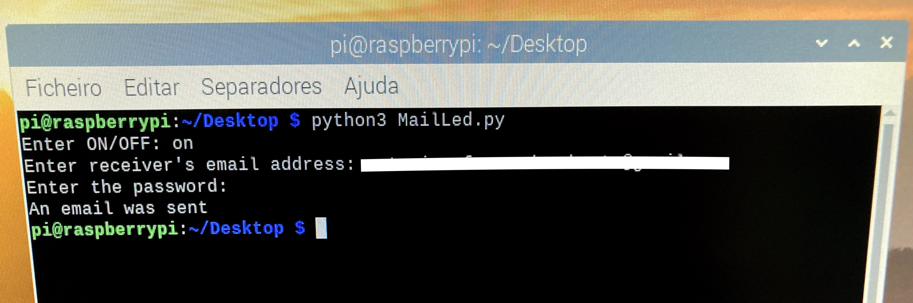

# Mail-Led

#### A small python project that sends an email saying the Raspberry Pi LED status

To run this program, first configure `mail_config.json`:

- "from" - Email address that will send the email
- "smtp" - SMTP address
- "port" - SMTP port

After that, run the program in the **terminal** with the command below:
    
        phyton3 MailLed.py

The terminal should look like this if the program runs properly:

